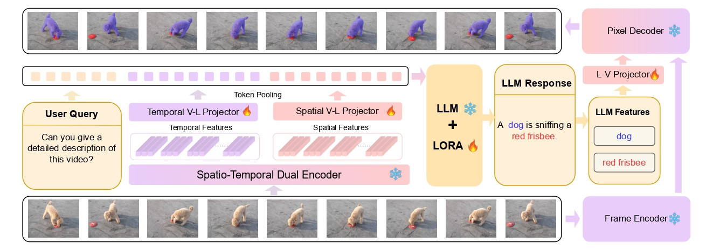

#   VideoGLaMM


[Shehan Munasinghe](https://github.com/shehanmunasinghe) , [Hanan Gani](https://github.com/hananshafi) , [Wenqi Zhu](#) , [Jiale Cao](https://jialecao001.github.io/), [Eric Xing](https://www.cs.cmu.edu/~epxing/), [Fahad Shahbaz Khan](https://scholar.google.es/citations?user=zvaeYnUAAAAJ&hl=en). [Salman Khan](https://salman-h-khan.github.io/),

**Mohamed bin Zayed University of Artificial Intelligence, Tianjin University,
Linköping University, Australian National University, Carnegie Mellon University**

[](https://mbzuai-oryx.github.io/VideoGLaMM/)
[](#)

---

## 📢 Latest Updates
- 📦 Code, checkpoints will be released soon. Stay tuned!
---

##   Overview

<p align="center">
  
</p>

VideoGLaMM is a large video multimodal video model capable of pixel-level visual grounding. The model responds to natural language queries from the user and intertwines spatio-temporal object masks in its generated textual responses to provide a detailed understanding of video content. VideoGLaMM seamlessly connects three key components: a Large Language Model (LLM); dual vision encoders; and a spatio-temporal pixel decoder. The dual vision encoders extract spatial and temporal features separately, which are jointly passed to the LLM to output responses rich in both spatial and temporal cues. This is facilitated by end-to-end training on our proposed benchmark Grounded conversation Generation (GCG) dataset featuring 38k Video-QA triplets with 87k objects and 671k fine-grained masks.


---
##   Architecture

<p align="center">
  
</p>


---

## Citation 📜

```bibtex
@article{munasinghe2024videoglamm,
  title={VideoGLaMM: A Large Multimodal Model for Pixel-Level Visual Grounding in Videos}, 
  author={Shehan Munasinghe and Hanan Gani and Wenqi Zhu and Jiale Cao and Eric Xing and Fahad Khan and Salman Khan},
  journal={ArXiv},
  year={2024}
}
```

---

[](https://www.ival-mbzuai.com)
[](https://github.com/mbzuai-oryx)
[](https://mbzuai.ac.ae)